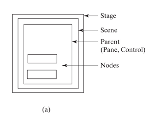

# JavaFX Notes

---

> JavaFX replaces the otudated wwing architecture whcih replaced AWT ( Abstract Windows Toolkit ).

## Structure 

* Make sure to import JavaFX: `import javafx.*`
* Every JavaFX program is defined in a class that extends javafx.application.Application.
* The launch method is a static method for launching a stand-alone JavaFX applications.
* After the JavaFX app is launched, the JVM goes to the start method( which should be overriden )
* An exmaple showing all of the above:  
```Java
import javafx.*;

public class TestClass extends Application {
  @Override
  public void start( Stage primaryStage ) {
    ..
  }
  public static void main( String[] args ) {
    Application.launch( args );
  }      
}
```

### Core Object Types

1. Button
2. Scene
3. Stage

* Button - self explanatory, it's a button. Constructed as: `Button btOK = new Button( "Ok" );`
* Scene - An object that conatains various nodes on the screen. Constructor is: `Scene( node, width, height )`
* Stage - a window object. The JVM automatically creates one called the **primary stage** when app is launched. To show the stage: `primaryStage.show();`
* Example using all the above concepts:  
```Java
import javafx.*;

public class MyJavaFX extends Application {
  @Override
  public void start(Stage primaryStage) {
    Button btOK = new Button("OK");
    Scene scene = new Scene(btOK, 200, 250);
    primaryStage.setTitle("MyJavaFX"); // Set the stage title
    primaryStage.setScene(scene); // Place the scene in the stage
    primaryStage.show(); // Display the stage
  }
  public static void main(String[] args) { 
    Application.launch(args); 
  }
}
```
* Layout is as such:  


