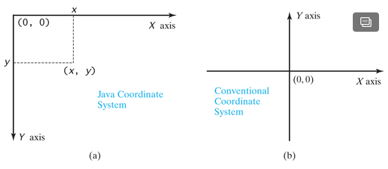

# JavaFX Notes

> JavaFX replaces the outdated wwing architecture whcih replaced AWT ( Abstract Windows Toolkit ).

## Structure 

---

* Make sure to import JavaFX: `import javafx.*`
* Every JavaFX program is defined in a class that extends javafx.application.Application.
* The launch method is a static method for launching a stand-alone JavaFX applications.
* After the JavaFX app is launched, the JVM goes to the start method( which should be overriden )
* An exmaple showing all of the above:  
```Java
import javafx.*;

public class TestClass extends Application {
  @Override
  public void start( Stage primaryStage ) {
    ..
  }
  public static void main( String[] args ) {
    Application.launch( args );
  }      
}
```

### Core Object Types

1. Button
2. Scene
3. Stage

* Button - self explanatory, it's a button. Constructed as: `Button btOK = new Button( "Ok" );`
* Scene - An object that conatains various nodes on the screen. Constructor is: `Scene( node, width, height )`
* Stage - a window object. The JVM automatically creates one called the **primary stage** when app is launched. To show the stage: `primaryStage.show();`
* Example using all the above concepts:  
```Java
import javafx.*; // This works but is not preferred

public class MyJavaFX extends Application {
  @Override
  public void start(Stage primaryStage) {
    Button btOK = new Button("OK");
    Scene scene = new Scene(btOK, 200, 250);
    primaryStage.setTitle("MyJavaFX"); // Set the stage title
    primaryStage.setScene(scene); // Place the scene in the stage
    primaryStage.show(); // Display the stage
  }
  public static void main(String[] args) { 
    Application.launch(args); 
  }
}
```
* Layout is as such:  


### Panes

> Panes are use to hold nodes, nodes can be shapes, images views, UI controls, and other panes.

* The layout with a pane & nodes:  
  

* You place nodes inside a pane and then places the plane into a cense ( like the above layout )
* Here is an example of using a pane:  
```Java
StackPane pane = new StackPane();
pane.getChildren().add( new Button( "Ok" ));
Scene scene = new Scene( pane, 200, 500 ); // measured in pixels
```

### Coordinates

* The x-coordinate increases from left to right and the y-coordinate increases downward in the Java coordinate system. For a visual explanation:  



* To place an object in the center of a pane, use: width/2 & height/2
* An HBox is a plane that places all nodes in one row

### Property Binding

> You can bind a target object to a source object. A change in the source object will be automatically reflected in the target object.

* Example of binding:  
```Java
Pane pane = new Pane();
Circle circle = new Circle();
circle.centerXProperty().bind( pane.widthProperty().divide ( 2 ));
circle.centerYProperty().bind( pane.heightProperty().divide ( 2 ));
pane.getChildren().add( cirlce );
```

## Styling :sunglasses:

___

### JavaFX CSS

> JavaFX style properties are similar to cascading style sheets (CSS). So, the style properties in JavaFX are called JavaFX CSS

* The syntax for setting a style is: `styleName:value`
* A more conrete example:  
```Java
circle.setStyle( "-fx-stroke: block; -fx-fill:red" );
// The above is equivalent to the following two lines
circle.setStroke( Color.BLACK );
circle.setFill( Color.RED );
```
* Will compile with incorrect CSS, the style will just be ignored

### Color

* The class `javafx.scene.paint.Color` contains Color info
* A color instance is contructed as such:  
```Java
// Contructor ( RGG:O )
public Color( double r, double g, double b, double opacity);`

// example
Color color = new Color( 0.25, 0.14, 0.33, 0.51 );
```
* Alternatively you can use any of these standard colors: BEIGE, BLACK, BLUE, BROWN, CYAN, DARKGRAY, GOLD, GRAY, GREEN, LIGHTGRAY, MAGENTA, NAVY, ORANGE, PINK, RED, SILVER, WHITE, and YELLOW
* Example using standard colors:
```Java
circle.setFill( Color.RED );
```

### Fonts

* The class `javafx.scene.text.Font` contains font info
* The fonts are pretty self explanatory, here is an example of sing fonts:  
```Java
Font font1 = new Font( "SansSerif", 16 );
Font font2 = new Font( "Times New Roman", FontWeight.BOLD,
  FontPosture.ITALIC, 12 );
```

### Images

> The **Image** class represents a graphical image and the **ImageView** class can be used to display an image

* The two calsses are:
  1. javafx.scene.image.Image
  2. javafx.scene.image.ImageView
* Simply **Image** creates a new image object and **ImageView** displayes it. Here is an example:  
```Java
Image image = new Image( "pics/arrow.png" );
ImageView imageview = new ImageView( image );

// Can also do it this way
ImageView imageView = new ImageView( "pics/arrow.png" );

// Also can use a URL
Image image2 = new Image( "http://www.cs.armstrong.edu/liang/image/us.gif" );
```

